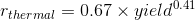

## Visualizations of the Nuclear Explosions Dataset

The visualizations here were made using the `#TidyTuesday` dataset of [nuclear
explosions](https://github.com/rfordatascience/tidytuesday/tree/master/data/2019/2019-08-20)
which where published by [`data is
plural`](https://github.com/data-is-plural/nuclear-explosions). Originally the
information came from a [report by the Stockholm International Peace Research
Institute
(SIPRI)](https://github.com/data-is-plural/nuclear-explosions/blob/master/documents/sipri-report-original.pdf).

I have calculated the thermal and blast ranges in terms of the yield, using
equations from the [Nuclear Weapons
FAQ](https://nuclearweaponarchive.org/Nwfaq/Nfaq5.html#nfaq5.1).

Range of a thermal effect capable of producing third degree burns: 

Range of a blast effect producing 20psi (100% mortality): 
