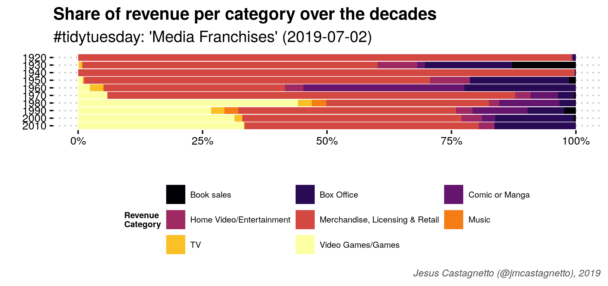

# Charts for `#TidyTuesday` datasets

## 2019-06-25: UFO Sightings

-Animation of UFO sightings
 using [tmap](https://github.com/mtennekes/tmap)

## 2019-07-02: Media Franchises

- Share of revenue per category over the decades

- An animated radar chart

using [gganimate](https://gganimate.com/) and [ggiraphExtra](https://github.com/cardiomoon/ggiraphExtra)

## 2019-07-09: WWC Results

- A ridges plot
 using [ggridges](https://github.com/clauswilke/ggridges)

- And a lollipop plot

## 2019-07-16: R4DS Online Learning Community Stats

- [An interactive calendar chart](2019-07-16-r4ds-members/calendar-chart.html) using [echarts4r](https://echarts4r.john-coene.com/index.html)
